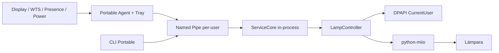
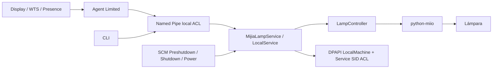

# MijiaLamp

Automatización local para lámparas Xiaomi/Mijia compatibles con `python-miio` en Windows 10/11.

**v3.1.3** ofrece dos modos sobre el mismo núcleo de policy/controller:

| | Portable | Hardened Service |
|---|---|---|
| Administrador | No | Sólo instalación/mantenimiento |
| Windows Service | No | Sí (`LocalService`) |
| Token | DPAPI `CurrentUser` | DPAPI `LocalMachine` + ACL Service SID |
| Display/WTS/User Presence | Sí | Sí |
| Tray y notificaciones | Sí | Sí |
| Sync físico/perfiles solares | Sí | Sí |
| Funciona sin sesión iniciada | No | Sí |
| Preshutdown/Shutdown SCM | Best effort | Sí |
| Runtime Python | `.venv` del usuario | Copia privada, inmutable para el usuario |
| Recomendado para | uso personal/simple | máxima fiabilidad y aislamiento |

> El repositorio público no contiene IP, DID, MAC, coordenadas, token ni estado de una instalación real.

## Funciones

- Display ON/OFF, Suspend/Resume, WTS Lock/Unlock y User Presence.
- Suspend preserva overrides temporales y Resume nunca enciende por sí solo: sólo un Display ON real puede restaurar el perfil.
- `PBT_APMRESUMEAUTOMATIC` no inventa presencia ni Display ON.
- Política solar con Astral, perfiles escalonados o continuos.
- Overrides manuales, pausa temporal y respeto configurable de cambios hechos desde Mi Home.
- Reconciliación contra `power`, `bright` y `ct` físicos.
- Protección contra carreras mediante `intent_revision`/`critical_off_revision`.
- OFF crítico de Suspend síncrono/acotado y sin discovery; Shutdown/Preshutdown mantienen reassert cancelable.
- Discovery: IP conocida → Windows Neighbor/MAC → mDNS → `/24` limitada.
- Cooldown/backoff de discovery y recuperación de caches JSON corruptos.
- Logs rotativos, redacción de tokens y validación estricta de configuración.
- 2 runtimes de seguridad explícitos: `CurrentUser` Portable y `LocalMachine` Service.

## Opción A — Portable (recomendada para empezar)

Portable no instala servicio, no escribe en `ProgramData` y no requiere PowerShell elevado. La **release Portable generada por el workflow** incluye un runtime Python privado ya preparado: no requiere tener Python instalado ni descargar dependencias. `setup-portable.ps1` verifica sus hashes y crea la configuración/directorios locales.

Si trabajás desde un clon del repositorio (sin runtime empaquetado), el mismo script crea `.venv` como fallback y prepara dependencias como usuario normal.

### 1. Extraer y configurar

Copiá `config.example.json` a `config.json` y completá como mínimo:

- `lamp_ip`
- `expected_model`
- `device_id`
- ubicación/timezone

### 2. Preparar como usuario normal

```powershell
Set-ExecutionPolicy -Scope Process Bypass
.\setup-portable.ps1
```

Si ya tenés una configuración de v2/v3, podés copiarla y migrarla de forma segura:

```powershell
.\setup-portable.ps1 -ConfigPath "C:\ruta\config.json"
```

Si esa configuración legacy todavía contiene un token plaintext, el migrador lo elimina del JSON y lo cifra con DPAPI `CurrentUser`.

En una release Portable oficial, esto **no instala nada**: verifica `runtime-manifest.json` y el runtime autocontenido incluido. En un clon/source ZIP sin runtime, crea `.venv` dentro de la carpeta y prepara dependencias sin privilegios administrativos.

Para un source ZIP al que le hayas agregado un `wheelhouse/` compatible, `-Offline` obliga a no usar PyPI.

### 3. Importar token

```powershell
.\import-token.ps1 -Mode Portable
```

El token queda cifrado mediante DPAPI `CurrentUser`: otro usuario de Windows no puede descifrarlo.

### 4. Iniciar

```text
start-portable.cmd
```

Aparecerá el icono de bandeja. Para diagnóstico:

```powershell
& ".\runtime\python.exe" .\lampctl.py --mode portable runtime-status
& ".\runtime\python.exe" .\lampctl.py --mode portable doctor
```

Habilitar automatización:

```powershell
.\enable-portable-automation.ps1
```

Autostart opcional, sin Administrador:

```powershell
.\enable-portable-autostart.ps1
```

Lo podés revertir con `disable-portable-autostart.ps1`.

## Opción B — Hardened Service

Este modo prioriza fiabilidad en shutdown/suspend y separación de privilegios.

### Verificar una release antes de elevar permisos

Si descargaste un ZIP oficial con runtime incluido, verificá **el ZIP original antes de extraerlo** contra este repositorio:

```powershell
gh attestation verify .\MijiaLamp-Service-VERSION.zip -R NicolasWeibel/mijia-lamp-automation
```

Si esa verificación falla o no existe una attestation para el ZIP, no ejecutes el instalador elevado. El archivo `.zip.sha256` detecta cambios accidentales, pero por sí solo no demuestra quién publicó el ZIP. La attestation acredita procedencia del build; tampoco garantiza que el código o sus dependencias estén libres de malware. Consultá [`docs/security.md`](docs/security.md) para el procedimiento y los límites.

La primera publicación de estos cambios debe usar la etiqueta `v3.1.3`. Verificá el ZIP correspondiente; una attestation de otra versión no cubre esta copia.

Los ZIPs generados localmente sin `-IncludePreparedRuntime` son bootstrap sin runtime preparado. Requieren la preparación indicada abajo y no cuentan por sí solos con la procedencia de una release oficial atestada.

### Principio de instalación

La fase elevada **no descarga paquetes, no ejecuta `pip` y no depende de un Python modificable en `%LOCALAPPDATA%`**.

El flujo es:

```text
usuario normal
  ↓
prepare-service-runtime.ps1
  ├─ descarga únicamente wheels binarios fijados
  ├─ construye una copia privada limpia de CPython
  ├─ instala dependencias sin elevación
  ├─ elimina pip/setuptools/wheel del runtime final
  ├─ prueba que el runtime sea reubicable
  └─ genera manifest SHA-256 de cada archivo

Administrador
  ↓
install.ps1
  ├─ NO usa Internet
  ├─ NO ejecuta pip
  ├─ verifica cada hash del runtime
  ├─ valida config/runtime en staging
  ├─ hace swap transaccional
  ├─ instala LocalService + Service SID
  ├─ limita RequiredPrivileges
  ├─ aplica ACLs
  ├─ prueba Named Pipe
  └─ ejecuta security-check.ps1
```

Las releases oficiales construidas por GitHub Actions pueden incluir ya `prepared-runtime/`; en ese caso no hace falta ejecutar la preparación local.

### 1. Preparar runtime (sólo si falta `prepared-runtime`)

En PowerShell **normal**:

```powershell
.\prepare-service-runtime.ps1 -Recreate
```

### 2. Instalar

Abrí una nueva PowerShell **como Administrador**:

```powershell
Set-ExecutionPolicy -Scope Process Bypass
.\install.ps1
```

El destino es:

```text
C:\ProgramData\MijiaLamp
```

La automatización queda deshabilitada inicialmente.

### 3. Token y diagnóstico

```powershell
cd C:\ProgramData\MijiaLamp
.\import-token.ps1 -Mode Service

& ".\runtime\python.exe" .\lampctl.py service-status
& ".\runtime\python.exe" .\lampctl.py doctor
```

### 4. Prueba manual y activación

```powershell
& ".\runtime\python.exe" .\lampctl.py manual-on
& ".\runtime\python.exe" .\lampctl.py manual-off
.\enable-automation.ps1
```

Auditoría local de seguridad:

```powershell
.\security-check.ps1
```

## Arquitectura

### Portable



### Hardened Service



Más detalle: [`docs/architecture.md`](docs/architecture.md), [`docs/security.md`](docs/security.md) y [`docs/windows-integration.md`](docs/windows-integration.md).

## Seguridad

El modo Service aplica, entre otras medidas:

- cuenta `NT AUTHORITY\LocalService`, no `LocalSystem`;
- Service SID específico;
- `RequiredPrivileges` reducido a `SeChangeNotifyPrivilege`;
- runtime Python privado bajo `ProgramData`, sin escritura del usuario;
- el servicio no depende del Python del perfil del usuario;
- `secrets/` sin ACE del usuario interactivo;
- código/runtime sólo `RX` para el usuario;
- Named Pipe con `PIPE_REJECT_REMOTE_CLIENTS`, SID exacto del usuario y **Service SID específico** (sin ACE amplia para `LocalService`);
- sin listener TCP;
- runtime preparado/hash-eado antes de elevar;
- instalador elevado offline y sin `pip`;
- staging + segunda verificación de hashes para cerrar TOCTOU + recuperación de archivos sin ejecutar el runtime anterior como Administrador; ante fallos, la automatización queda detenida hasta reinstalar desde una release verificada;
- `integrity-manifest.json` permite revalidar código/runtime instalados;
- `security-check.ps1` comprueba invariantes después de instalar.

Portable tiene una superficie menor: no crea servicio ni requiere Admin, y el token queda bajo DPAPI `CurrentUser`.

## Comandos

Modo Service (desde la instalación):

```powershell
& ".\runtime\python.exe" .\lampctl.py status
& ".\runtime\python.exe" .\lampctl.py doctor
& ".\runtime\python.exe" .\lampctl.py manual-on
& ".\runtime\python.exe" .\lampctl.py manual-off
```

Modo Portable (release oficial):

```powershell
& ".\runtime\python.exe" .\lampctl.py --mode portable status
& ".\runtime\python.exe" .\lampctl.py --mode portable doctor
& ".\runtime\python.exe" .\lampctl.py --mode portable manual-on
& ".\runtime\python.exe" .\lampctl.py --mode portable manual-off
```

En un clon de desarrollo sin runtime empaquetado, reemplazá `runtime\python.exe` por `.venv\Scripts\python.exe`.

## Desarrollo

```powershell
python -m unittest discover -s tests -p "test_*.py" -v
python scripts/check_repository.py
pwsh -NoProfile -ExecutionPolicy Bypass -File scripts/check-powershell.ps1
```

Construir releases:

```powershell
.\scripts\build-release.ps1
```

Si `prepared-runtime` existe:

```powershell
.\scripts\build-release.ps1 -IncludePreparedRuntime
```

Para preparar el repositorio público y publicar versiones mediante tags anotados, seguí [`docs/github-setup.md`](docs/github-setup.md). Crear un ZIP local no publica una release.

## Compatibilidad

Diseñado y probado principalmente alrededor de `yeelink.light.lamp22`. Otros modelos miIO pueden exponer propiedades/rangos diferentes.

Python soportado para preparación/Portable: **3.10–3.12**.

## Licencia

GPL-3.0-only. Ver [`LICENSE`](LICENSE).
